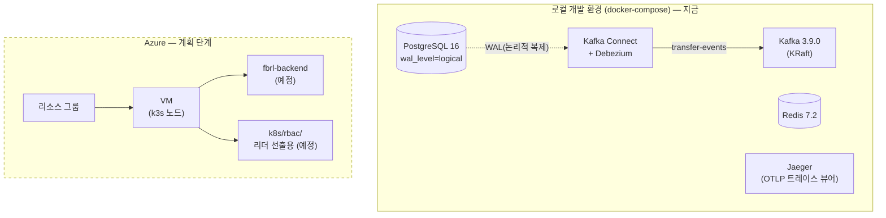

# fbrl-infra

`fbrl-backend`의 인프라를 담당하는 레포다. 애플리케이션 코드 자체는
[farmer0010/fbrl-backend](https://github.com/farmer0010/fbrl-backend)에 있고, 여기서는
로컬 개발 환경, Kubernetes 매니페스트, Terraform 계획, 배포/운영 문서를 관리한다.

## 기술 스택


## 인프라 구성도

왼쪽은 지금 돌아가는 로컬 개발 환경이고, 오른쪽은 앞으로 만들 Azure 인프라다. Azure 쪽은
아직 계정도 없는 계획 단계라 점선으로 구분해뒀다.



## 담당 영역

- 로컬 개발 인프라(docker-compose) 구성 및 검증 완료 — PostgreSQL, Redis, Kafka, Kafka
  Connect, Jaeger 5개 서비스가 정상 기동되는 것까지 확인했다.
- Debezium Outbox 커넥터 등록 및 Kafka Connect 연동까지 확인했다. 다만 실제 CDC 데이터
  흐름은 백엔드 배포 후 검증 예정이다 — `outbox_event` 테이블은 백엔드 애플리케이션이
  마이그레이션을 돌려야 생기는데, 이 레포에는 그 코드가 없어서 지금은 커넥터 태스크가
  FAILED 상태로 뜨는 게 정상이다.
- `k8s/rbac/`에 리더 선출용 RBAC 매니페스트를 준비해뒀지만, 실제 K8s 클러스터가 없어
  적용 전 단계다.
- Terraform 계획 문서(`terraform/README.md`)를 작성했다. Azure 계정을 만들기 전이라
  실행 코드(`.tf`)는 아직 없다.
- Chaos Mesh 기반 장애 주입 검증은 로드맵상 예정 항목이고, 아직 손대지 않았다.

## 로컬 실행 방법

```bash
docker-compose up -d
curl -X POST -H "Content-Type: application/json" \
  --data @debezium/outbox-connector.json \
  http://localhost:8083/connectors
```

- 5개 서비스 상태는 `docker-compose ps`로 확인한다.
- 분산 트레이스는 Jaeger UI(`http://localhost:16686`)에서 볼 수 있다.
- 커넥터 상태는 `curl http://localhost:8083/connectors/fbrl-outbox-connector/status`로
  확인한다. `outbox_event` 테이블이 없는 로컬 환경에서는 태스크가 FAILED로 뜨는 게
  정상이며, `fbrl-backend`를 별도로 띄워 마이그레이션을 돌리면 해결된다.
- 끌 때는 `docker-compose down`, 볼륨까지 지우려면 `docker-compose down -v`.

## 담당자

| 이름 | 역할 |
|---|---|
| 김준희 | Infra / SRE |

## 더 알아보기

- 인프라 로드맵: [`ROADMAP.md`](./docs/ROADMAP.md)
- 작업 일지: [`PROGRESS.md`](./docs/PROGRESS.md)
- 배포 시 필수 환경변수 체크리스트: [`DEPLOYMENT.md`](./docs/DEPLOYMENT.md)
- Terraform 계획: [`terraform/README.md`](./terraform/README.md)
