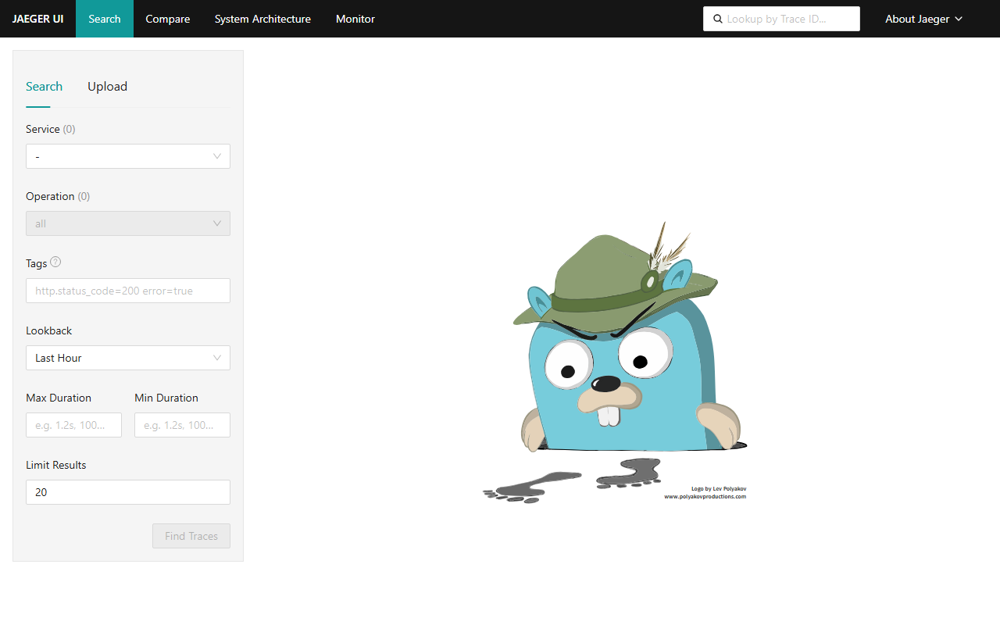
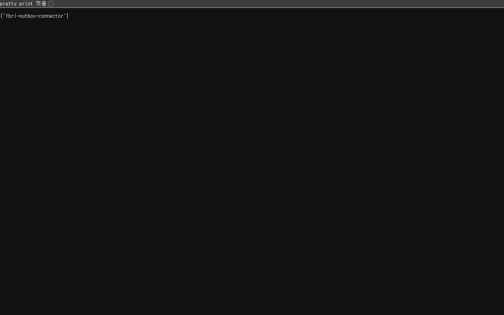

# PROGRESS

fbrl-infra 작업 일지. 날짜별로 뭘 했는지, 왜 그렇게 했는지, 캡처 화면을 기록한다.
형식은 farmer0010/fbrl-backend의 PROGRESS.md를 참고했다.

## 2026-08-17

- fbrl-infra 레포를 fbrlTeam 오가니제이션으로 이전함
- 로컬 docker-compose 환경(postgres/redis/kafka/kafka-connect/jaeger) 검증 완료
- docs/ROADMAP.md, terraform/README.md 작성

### Debezium 커넥터 등록 테스트

커넥터를 등록하고 상태를 확인했다.

```
$ curl -X POST -H "Content-Type: application/json" \
    --data @debezium/outbox-connector.json \
    http://localhost:8083/connectors

{"name":"fbrl-outbox-connector","config":{"connector.class":"io.debezium.connector.postgresql.PostgresConnector","database.hostname":"postgres","database.port":"5432","database.user":"fbrl_user","database.password":"fbrlpassword","database.dbname":"fbrl_db","topic.prefix":"fbrl","table.include.list":"public.outbox_event","plugin.name":"pgoutput","slot.name":"fbrl_outbox_slot","publication.autocreate.mode":"filtered","tombstones.on.delete":"false","key.converter":"org.apache.kafka.connect.storage.StringConverter","value.converter":"org.apache.kafka.connect.storage.StringConverter","transforms":"outbox","transforms.outbox.type":"io.debezium.transforms.outbox.EventRouter","transforms.outbox.table.field.event.id":"id","transforms.outbox.route.by.field":"aggregate_type","transforms.outbox.table.field.event.key":"aggregate_id","transforms.outbox.table.field.event.type":"event_type","transforms.outbox.table.field.event.payload":"payload","transforms.outbox.route.topic.replacement":"transfer-events","transforms.outbox.table.fields.additional.placement":"trace_id:header:trace_id,span_id:header:span_id","name":"fbrl-outbox-connector"},"tasks":[],"type":"source"}
HTTP_STATUS:201
```

```
$ curl http://localhost:8083/connectors/fbrl-outbox-connector/status

{"name":"fbrl-outbox-connector","connector":{"state":"RUNNING","worker_id":"172.19.0.6:8083"},"tasks":[{"id":0,"state":"FAILED","worker_id":"172.19.0.6:8083","trace":"org.apache.kafka.connect.errors.ConnectException: Unable to create filtered publication dbz_publication for \n\t...\nCaused by: io.debezium.DebeziumException: No table filters found for filtered publication dbz_publication\n\t..."}],"type":"source"}
HTTP_STATUS:200
```

커넥터 자체 등록(REST API 요청)은 `201 Created`로 성공했지만, 실제 태스크는 `FAILED` 상태다.
에러 메시지는 `table.include.list`(`public.outbox_event`)에 해당하는 테이블을 찾을 수 없어
filtered publication을 만들 수 없다는 내용이다. `docker exec fbrl-postgres psql -U fbrl_user
-d fbrl_db -c "\dt"`로 직접 확인해보니 `fbrl_db`에 테이블이 하나도 없었다 — 이 레포에는
인프라 설정만 있고 `fbrl-backend`의 애플리케이션 코드(스키마 마이그레이션 포함)가 없으니
`outbox_event` 테이블이 애초에 만들어질 수 없는 상황이다. 즉 Debezium 설정 자체의 문제라기보다
로컬에 백엔드 앱을 띄워 마이그레이션을 돌리기 전까지는 당연히 나는 실패다.

스크린샷: , 
